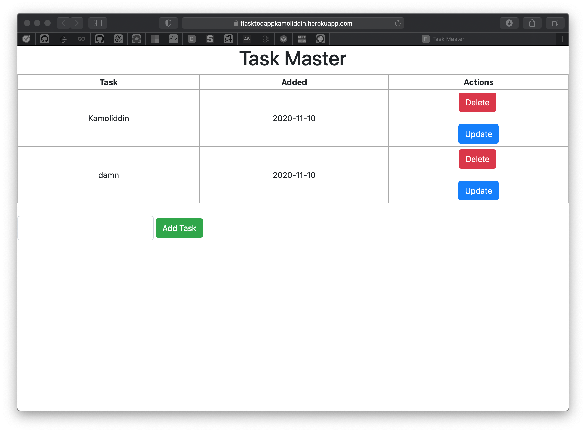

# Flask To_Do App

Simple Flask CRUD app to create and manage your tasks.

### Heroku

https://flasktodappkamoliddin.herokuapp.com

### Dependencies

```
requirements.txt
pipenv
flask
```

### Set up

```
1) clone repository
2) go to project directory
3) pipenv shell

pipenv will install all required packages for you.
```


